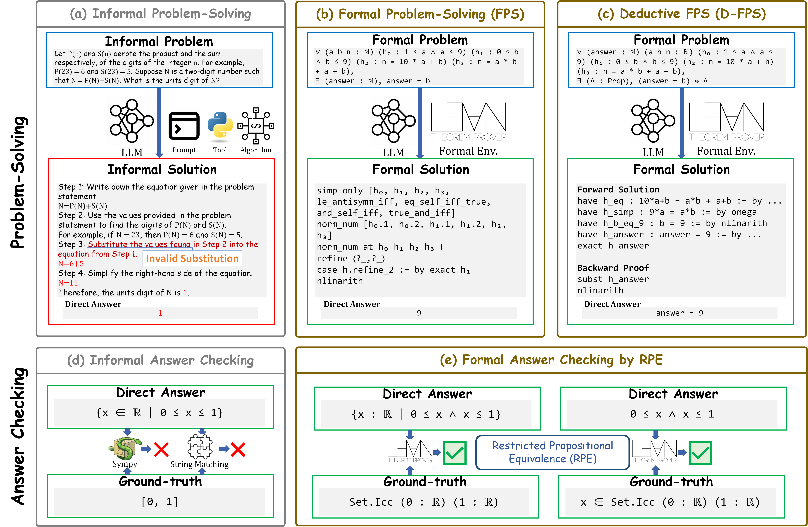

# Beyond Theorem Proving: Formulation, Framework and Benchmark for Formal Problem-Solving

This repository is the official implementation of _Beyond Theorem Proving: Formulation, Framework and Benchmark for Formal Problem-Solving_. 

Our research focuses:
1. What is problem-solving?
2. Beyond proving known targets, how to conduct process-verified problem-solving inside existing formal theorem proving (FTP) environments?

## Abstract
As a seemingly self-explanatory task, _problem-solving_ has been a significant component of science and engineering. However, a general yet concrete formulation of problem-solving itself is missing. With the recent development of AI-based problem-solving agents, the demand for process-level verifiability is rapidly increasing yet underexplored.
To fill these gaps, we present a principled formulation of problem-solving as a deterministic Markov decision process; a novel framework, **FPS** (_**F**ormal **P**roblem-**S**olving_), which utilizes existing FTP (formal theorem proving) environments to perform process-verified problem-solving; and **D-FPS** (_**D**eductive **FPS**_), decoupling solving and answer verification for better human-alignment. The expressiveness, soundness and completeness of the frameworks are proven.
We construct three benchmarks on problem-solving: **FormalMath500**, a formalization of a subset of the MATH500 benchmark; **MiniF2F-Solving** and **PutnamBench-Solving**, adaptations of FTP benchmarks MiniF2F and PutnamBench.
For faithful, interpretable, and human-aligned evaluation, we propose **RPE** (_**R**estricted **P**ropositional **E**quivalence_), a symbolic approach to determine the _correctness_ of answers by formal verification.
We evaluate four prevalent FTP models and two prompting methods as baselines, solving at most $23.77\%$ of FormalMath500, $27.47\%$ of MiniF2F-Solving, and $0.31\%$ of PutnamBench-Solving.





## Requirements
- [1][Lean 4](https://github.com/leanprover/lean4): `v4.15.0`
- [2][Mathlib 4](https://github.com/leanprover-community/mathlib4): `v4.15.0`
- [3][Aesop](https://github.com/leanprover-community/aesop): `v4.15.0`
- [4][Pantograph](https://github.com/lenianiva/Pantograph): `v0.2.25`

Please install Pantograph and link `/path/to/Pantograph/.lake/build/bin/repl` to `common/pantograph/pantograph-repl`

## Benchmarks
- **FormalMath500** is a formalized subset of the prevalent MATH500 benchmark[5,6], including 387 data points:
    - 123 about `Algebra`
    - 92 about `Intermediate Algebra`
    - 62 about `Number Theory`
    - 65 about `Prealgebra`
    - 45 about `Precalculus`

- **MiniF2F-Solving** is a refactored subset of MiniF2F[7], containing in 375 data points with:
    - 30 from `AIME`
    - 140 from `MATH-Algebra`
    - 82 from `AMC`
    - 3 from `IMO`
    - 120 from `MATH-Number Theory`

- **PutnamBench-Solving** is a refactored subset of PutnamBench[8], containing 324 data points with:
    - 9 about `Abstract Algebra`
    - 138 about `Algebra`
    - 122 about `Analysis`
    - 14 about `Combinatorics`
    - 28 about `Geometry`
    - 25 about `Linear Algebra`
    - 49 about `Number Theory`
    - 8 about `Probability`
    - 4 about `Set Theory`

## Evaluation

Please run the following commands to reproduce baseline experiments.

\*For Proof Search and Whole-Proof Generation, set `only_proving=False` to evaluate FPS (finding a correct answer + proving its correctness) and `only_proving=True` to evaluate FTP (proving the correctness of the ground-truth answer).

### Proof Search (FPS)
- `model=stepprover_vanilla_avggoal`: Best-first Search w/ InternLM2.5-StepProver
- `model=leanstar_vanilla_avggoal`: Best-first Search w/ LeanSTaR

```shell
ulimit -s unlimited
for FPS_BENCHMARK in formal_math500 minif2f_solving putnam_solving;
do
    python -m evaluator.fps_proof_search \
            --log_root /path/to/output \
            --model "model_to_evaluate" \
            --benchmark ${FPS_BENCHMARK} \
            --project_root /path/to/mathlib4 \
            --max_search_trials 600 \
            --temperature 0.7 \
            --max_tokens 256 \
            --num_concurrency 32 \
            --verbose False \
            --gen_base_url "https://url.to.openai-style.api.server/" \
            --gen_api_key "gen_api_key" \
            --gen_model_name "name/of/proof-search-model" \
            --only_proving False
done
```

### Whole-Proof Generation (FPS)
- `model=deepseek_prover`: DeepSeekProver-V1.5
- `model=theoremllama`: TheoremLlama

```shell
ulimit -s unlimited
for FPS_BENCHMARK in formal_math500 minif2f_solving putnam_solving;
do
    python -m evaluator.fps_whole_proof_generation \
            --log_root /path/to/output \
            --model "model_to_evaluate" \
            --benchmark ${FPS_BENCHMARK} \
            --project_root /path/to/mathlib4 \
            --num_samples_per_trial 128 \
            --temperature 1.0 \
            --top_p 0.95 \
            --max_tokens 2048 \
            --num_concurrency 8 \
            --verbose False \
            --gen_base_url "https://url.to.openai-style.api.server/" \
            --gen_api_key "gen_api_key" \
            --gen_model_name "name/of/whole-proof-generation-model" \
            --only_proving False
done
```

### Prompting Methods (D-FPS)
- In-Context Learning

```shell
ulimit -s unlimited
for FPS_BENCHMARK in formal_math500 minif2f_solving putnam_solving;
do
    ulimit -s unlimited
    python -m evaluator.fps_icl \
            --log_root /path/to/output \
            --benchmark ${FPS_BENCHMARK} \
            --project_root /path/to/mathlib4 \
            --num_samples_per_trial 16 \
            --temperature 1.0 \
            --top_p 0.95 \
            --max_tokens 8192 \
            --num_concurrency 16 \
            --verbose False \
            --gen_base_url "https://url.to.openai-style.api.server/" \
            --gen_api_key "api-key" \
            --gen_model_name "name/of/general-LLM"
done
```

- Hybrid CoT

```shell
ulimit -s unlimited
for FPS_BENCHMARK in formal_math500 minif2f_solving putnam_solving;
do
    ulimit -s unlimited
    python -m evaluator.fps_hybrid_cot \
            --log_root /path/to/output \
            --benchmark ${FPS_BENCHMARK} \
            --num_samples_per_trial 16 \
            --temperature 1.0 \
            --top_p 0.95 \
            --max_tokens 8192 \
            --num_concurrency 16 \
            --verbose False \
            --gen_base_url "https://url.to.openai-style.api.server/" \
            --gen_api_key "api-key" \
            --gen_model_name "name/of/general-LLM"
done
```

## Baseline Performance
- _Solved_: indicates the portion that is successfully solved;
- _Proven_: indicates the portion whose statements (asserting the correctness of ground-truth answer) are proven;
- _NE-Submitted_: indicates the portion of problems whose submitted answers are incorrect under RPE (lower is better).

| Framework | Benchmark       | Method                 | Model                   | Solved↑ | Proven↑ | NE-Submitted↓ |
|-----------|-----------------|------------------------|-------------------------|---------|---------|---------------|
| FPS       | FormalMath500   | Proof Search           | InternLM2.5-StepProver  | 23.77%  | 47.55%  | 19.38%        |
|           |                 |                        | LeanSTaR                | 23.51%  | 43.41%  | 20.93%        |
|           |                 | Whole-Proof Generation | DeepSeekProver-V1.5     | 22.22%  | 46.51%  | 14.47%        |
|           |                 |                        | TheoremLlama            | 16.02%  | 4.39%   | 15.50%        |
|           | MiniF2F-Solving | Proof Search           | InternLM2.5-StepProver  | 27.47%  | 50.67%  | 13.60%        |
|           |                 |                        | LeanSTaR                | 24.27%  | 49.33%  | 14.40%        |
|           |                 | Whole-Proof Generation | DeepSeekProver-V1.5     | 22.40%  | 53.60%  | 10.93%        |
|           |                 |                        | TheoremLlama            | 13.07%  | 7.73%   | 8.80%         |
|           | Putnam-Solving  | Proof Search           | InternLM2.5-StepProver  | 0.00%   | 1.54%   | 28.09%        |
|           |                 |                        | LeanSTaR                | 0.00%   | 0.93%   | 41.05%        |
|           |                 | Whole-Proof Generation | DeepSeekProver-V1.5     | 0.31%   | 1.54%   | 22.22%        |
|           |                 |                        | TheoremLlama            | 0.00%   | 0.31%   | 16.67%        |
| D-FPS     | FormalMath500   | ICL                    | DeepSeek-V3             | 13.70%  |         | 0.00%         |
|           |                 | Hybrid CoT             | DeepSeek-V3             | 15.50%  |         | 1.03%         |
|           | MiniF2F-Solving | ICL                    | DeepSeek-V3             | 21.87%  |         | 0.00%         |
|           |                 | Hybrid CoT             | DeepSeek-V3             | 21.60%  |         | 0.00%         |
|           | Putnam-Solving  | ICL                    | DeepSeek-V3             | 0.00%   |         | 0.00%         |
|           |                 | Hybrid CoT             | DeepSeek-V3             | 0.00%   |         | 0.31%         |


## Contributing
This project is released under the Apache 2.0 license. Please see the [LICENSE](./LICENSE) file for more information.

Feel free to discuss the paper/data/code with us through issues/emails!
- (Anonymous)

## References
[1] Moura, Leonardo de, and Sebastian Ullrich. "The Lean 4 theorem prover and programming language." Automated Deduction–CADE 28: 28th International Conference on Automated Deduction, Virtual Event, July 12–15, 2021, Proceedings 28. Springer International Publishing, 2021.

[2] Community, Mathlib . "The Lean mathematical library.", 10.1145/3372885.3373824. 2019.

[3] Limperg, Jannis, and Asta Halkjær From. "Aesop: White-box best-first proof search for Lean." Proceedings of the 12th ACM SIGPLAN International Conference on Certified Programs and Proofs. 2023.

[4] Aniva, Leni, et al. "Pantograph: A Machine-to-Machine Interaction Interface for Advanced Theorem Proving, High Level Reasoning, and Data Extraction in Lean 4." arXiv preprint arXiv:2410.16429 (2024).

[5] Lightman, Hunter, et al. "Let's verify step by step." The Twelfth International Conference on Learning Representations. 2023.

[6] Hendrycks, Dan, et al. "Measuring mathematical problem solving with the math dataset." arXiv preprint arXiv:2103.03874 (2021).

[7] Zheng, Kunhao, Jesse Michael Han, and Stanislas Polu. "Minif2f: a cross-system benchmark for formal olympiad-level mathematics." arXiv preprint arXiv:2109.00110 (2021).

[8] Tsoukalas, George, et al. "Putnambench: Evaluating neural theorem-provers on the putnam mathematical competition." arXiv preprint arXiv:2407.11214 (2024).
